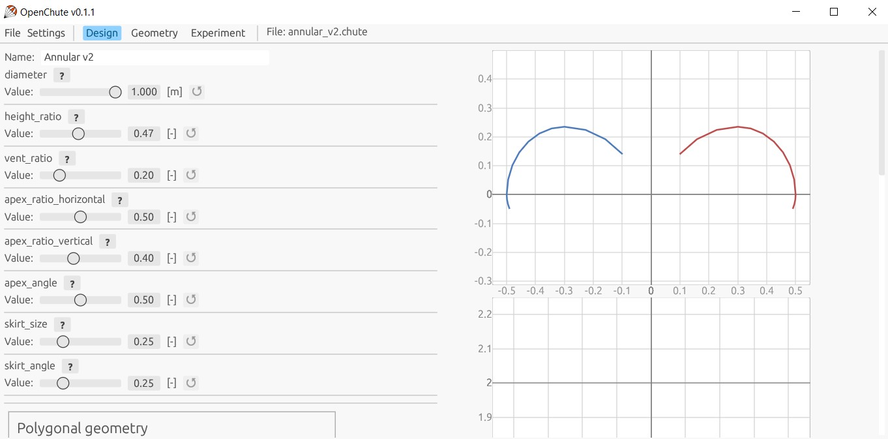

# openchute
Work in progress parachute design program for generating circularly symmetric sewing patterns. Comes with examples for disk-gap-band, toroidal, hemispherical, and cross parachutes.

# Installation and instructions
If you're on Windows, download the latest version from the releases. On another system, clone the repository and use `cargo run` (TODO: add compiled versions for other systems).

1. Unzip the folder. It contains some example parachutes
2. Execute the .exe file. Select "Open parachute" and select an example file
3. Tweak the shape parameters. The diameter is the main thing to modify. See the list of instructions for design-specific information.
4. Change the number of gores and preview color if desired.
5. Modify the seam allowances depending on seam type. Top/bottom can be used for different seam allowances at vent and hem. "Cut out seam allowance corners" removes fabric at corners.
6. The displayed "Chute canopy area" can be used for drag estimation. The "Total area" can be used for mass estimation.
7. `file->save design` and save the design somewhere
8. For printing out the pattern, use `expert PDF`. Print out the pattern at 100% scale. Adobe acrobat reader or similar can print tile multiple sheets (poster mode). A project backup is saved with the pdf.
9. For laser cutting, use `expert DXF`, note that the units are mm by default.
10. Sew the parachute :). Some useful resources are towards bottom of this page.

# Code todos
* Add labels to the parachute section
* Combine material list in one place
* Make file operations work on the web
* Add 3D scale indicator + different options
* Add reference square and information to pdf export
* Backup specs with PDF
* Fix flat sheet parachute circle with vent hole (allow cutouts)
* Fix all the unwrap operations

# TODO:

Basic:

* Calculate fabric surface area and weight

* Simple UI - DONE
* Area, mass, drag estimation
* Custom seam allowances - DONE
* Output to DXF - DONE
* Gore and cross section preview - DONE
* Draw gores for spherical, elliptical, toroidal parachutes (done)
* Save and load from JSON file format - DONE

Advanced:
* Non-spherical parachutes (e.g. cross parachute). Based on input of arbitrary geometry.
* Works on the web
* Shape generators (e.g. ringsail profile + number of sails)
* Basic shock load and descent simulation, including suspension line sizing
* Both circular and polygonal outer profile - DONE
* 3D visualizer - DONE
* PDF output - DONE
* Multiple bands (e.g. DGB) - DONE
* Gore fullness expansion (e.g. for ringsail)

Ideas

* egui for UI stuff. Could work on web as well...
* https://github.com/fschutt/printpdf for PDF
* https://docs.rs/dxf/latest/dxf/ for DXF writing
* https://github.com/asny/three-d for 3D stuff
* nalgebra for geometry stuff

# Useful resources
One of the best resources on parachute design is Knacke's [Parachute recovery systems: design manual](https://apps.dtic.mil/sti/pdfs/ADA247666.pdf), it's very comprehensive. Definitely have a look through it.
Other useful resources are listed below.

## Parachute types and design

* Britting, Thomas, et al. "Selection criteria for parachutes of student-built sounding rockets.": http://dx.doi.org/10.5821/conference-9788419184405.133
* Ewing, Edgar G., and Jack R. Vickers. Ringsail parachute design.: https://apps.dtic.mil/sti/citations/tr/AD0745335

## Construction and materials

* Fruity Chutes, "How We Make Our Parachutes": https://fruitychutes.com/help_for_parachutes/drone-parachute-tutorials/how_to_make_a_parachute
* Ben Graybeal, video guides on sewing French fell seam using [ribbon](https://www.youtube.com/watch?v=lRLMDuKfX6I), [tape](https://www.youtube.com/watch?v=hL8AnuxcckM), [pins](https://www.youtube.com/watch?v=iMDFjFHH3Q4), and [freehand](https://www.youtube.com/watch?v=cat63OAIbfA)

# Where to get materials?
There are many sources for parachute materials. Some of the popular ones are listed here, but note that these might not be the best or cheapest option depending on where you live. 

# Ripstop nylon
The most common canopy material is ripstop nylon, with low-weight and calendared fabric having better packing volume. MIL-SPEC C-44378 specifies 1.1-1.2 Oz/square feet (38-41 gsm), but other types of ripstop can work for amateur use. Kite fabric can be an inexpensive source of ripstop nylon, but note that they are often coated with polyurethane, resulting in a stiffer fabric. Note that options not specifically made for parachutes may have a lower strength.

* Ripstop by the roll (US): https://ripstopbytheroll.com/
* Emma kites (US): https://www.emmakites.com/
* Extremtextil (EU): https://www.extremtextil.de/
* ripstop.pl (EU): https://www.ripstop.pl/
* BlackCatRocketry (UK): https://www.blackcatrocketry.co.uk/products/1-1oz-silicon-coated-ripstop-nylon
* Kite fabric sellers on Aliexpress, e.g. [9KM-KITES](https://aliexpress.com/store/5584306) (also available through Amazon)
* Ebay
* Local fabric sellers (note that it might be a lot thicker than what you want).

# Canopy lines
Canopy lines are commonly made of nylon, kevlar, or UHMWPE (trade names spectra, dyneema etc.). Some places to order from are:

* Emma kites (US): https://www.emmakites.com/
* [9KM-KITES](https://aliexpress.com/store/5584306) or [9KM-DWLIFE](https://aliexpress.com/store/4670014) (Aliexpress) 
* Shops for skydiving stuff.

# Misc. parachute stuff
This may include swivels, quicklinks, harnesses etc.

* Fruity chutes: https://shop.fruitychutes.com
* Fishing stores (Swivels for small parachutes)